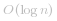

#### 方法一：二分查找

记选出的数字为  ，猜测的数字为 *x*。根据题目描述，若   则说明  ，否则  。

根据这一性质我们可以使用二分查找来求出答案  。

二分时，记当前区间为 ![\[\textit{left},\textit{right}\] ](./p___textit{left},textit{right}__.png) ，初始时  ， 。记区间中间元素为  ，若有   则说明 ![\textit{pick}\in\[\textit{left},\textit{mid}\] ](./p__textit{pick}_in__textit{left},textit{mid}__.png) ，否则 ![\textit{pick}\in\[\textit{mid}+1,\textit{right}\] ](./p__textit{pick}_in__textit{mid}+1,textit{right}__.png) 。当区间左右端点相同时，则说明我们找到了答案，退出循环。

```C++ [sol1-C++]
class Solution {
public:
    int guessNumber(int n) {
        int left = 1, right = n;
        while (left < right) { // 循环直至区间左右端点相同
            int mid = left + (right - left) / 2; // 防止计算时溢出
            if (guess(mid) <= 0) {
                right = mid; // 答案在区间 [left, mid] 中
            } else {
                left = mid + 1; // 答案在区间 [mid+1, right] 中
            }
        }
        // 此时有 left == right，区间缩为一个点，即为答案
        return left;
    }
};
```

```Java [sol1-Java]
public class Solution extends GuessGame {
    public int guessNumber(int n) {
        int left = 1, right = n;
        while (left < right) { // 循环直至区间左右端点相同
            int mid = left + (right - left) / 2; // 防止计算时溢出
            if (guess(mid) <= 0) {
                right = mid; // 答案在区间 [left, mid] 中
            } else {
                left = mid + 1; // 答案在区间 [mid+1, right] 中
            }
        }
        // 此时有 left == right，区间缩为一个点，即为答案
        return left;
    }
}
```

```C# [sol1-C#]
public class Solution : GuessGame {
    public int GuessNumber(int n) {
        int left = 1, right = n;
        while (left < right) { // 循环直至区间左右端点相同
            int mid = left + (right - left) / 2; // 防止计算时溢出
            if (guess(mid) <= 0) {
                right = mid; // 答案在区间 [left, mid] 中
            } else {
                left = mid + 1; // 答案在区间 [mid+1, right] 中
            }
        }
        // 此时有 left == right，区间缩为一个点，即为答案
        return left;
    }
}
```

```go [sol1-Golang]
func guessNumber(n int) int {
    return sort.Search(n, func(x int) bool { return guess(x) <= 0 })
}
```

```JavaScript [sol1-JavaScript]
var guessNumber = function(n) {
    let left = 1, right = n;
    while (left < right) { // 循环直至区间左右端点相同
        const mid = Math.floor(left + (right - left) / 2); 
        if (guess(mid) <= 0) {
            right = mid; // 答案在区间 [left, mid] 中
        } else {
            left = mid + 1; // 答案在区间 [mid+1, right] 中
        }
    }
    // 此时有 left == right，区间缩为一个点，即为答案
    return left;
};
```

```C [sol1-C]
int guessNumber(int n) {
    int left = 1, right = n;
    while (left < right) {  // 循环直至区间左右端点相同
        int mid = left + (right - left) / 2;  // 防止计算时溢出
        if (guess(mid) <= 0) {
            right = mid;  // 答案在区间 [left, mid] 中
        } else {
            left = mid + 1;  // 答案在区间 [mid+1, right] 中
        }
    }
    // 此时有 left == right，区间缩为一个点，即为答案
    return left;
}
```

```Python [sol1-Python3]
class Solution:
    def guessNumber(self, n: int) -> int:
        left, right = 1, n
        while left < right:
            mid = (left + right) // 2
            if guess(mid) <= 0:
                right = mid   # 答案在区间 [left, mid] 中
            else:
                left = mid + 1   # 答案在区间 [mid+1, right] 中
        
        # 此时有 left == right，区间缩为一个点，即为答案
        return left
```

**复杂度分析**

- 时间复杂度： 。时间复杂度即为二分的次数，每次二分我们将区间的长度减小一半，直至区间长度为 *1* 时二分终止，而区间初始长度为 *n*，因此二分次数为  。

- 空间复杂度：*O(1)*。