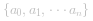
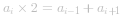
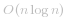
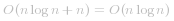

#### 方法一：模拟

**思路与算法**

首先我们对原序列排序，假设排序之后序列为  ，如果对 ![i\in\[1,n-1\] ](./p__i_in__1,_n_-_1__.png)  中的每个数都有   成立，那么这个数列就是等差数列。

**代码**

```cpp [sol1-C++]
class Solution {
public:
    bool canMakeArithmeticProgression(vector<int>& arr) {
        sort(arr.begin(), arr.end());
        for (int i = 1; i < arr.size() - 1; ++i) {
            if (arr[i] * 2 != arr[i - 1] + arr[i + 1]) {
                return false;
            }
        }
        return true;
    }
};
```

```Java [sol1-Java]
class Solution {
    public boolean canMakeArithmeticProgression(int[] arr) {
        Arrays.sort(arr);
        for (int i = 1; i < arr.length - 1; ++i) {
            if (arr[i] * 2 != arr[i - 1] + arr[i + 1]) {
                return false;
            }
        }
        return true;
    }
}
```

```python [sol1-Python3]
class Solution:
    def canMakeArithmeticProgression(self, arr: List[int]) -> bool:
        arr.sort()
        for i in range(1, len(arr) - 1):
            if arr[i] * 2 != arr[i - 1] + arr[i + 1]:
                return False
        return True
```

```csharp [sol1-C#]
public class Solution 
{
    public bool CanMakeArithmeticProgression(int[] arr) 
    {
        Array.Sort(arr);
        for (int i = 1; i < arr.Length - 1; ++i)
        {
            if (arr[i] * 2 != arr[i - 1] + arr[i + 1]) 
            {
                return false;
            }
        }

        return true;
    }
}
```

**复杂度分析**

+ 时间复杂度： 。排序的时间代价为  ，遍历序列的时间代价是 *O(n)*，故渐进时间复杂度为  。
+ 空间复杂度： 。快速排序中使用的栈空间期望是  。